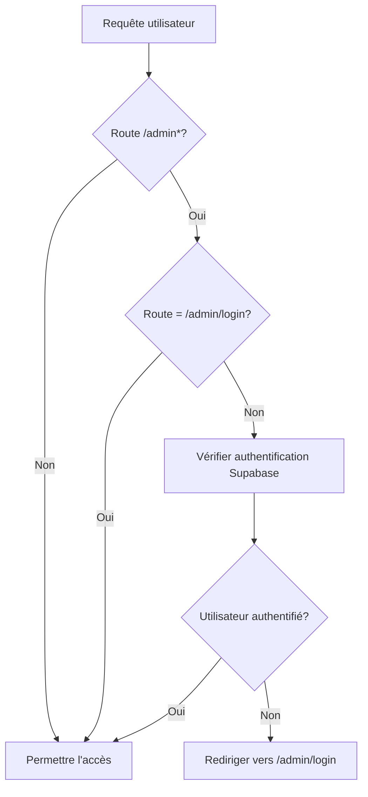

# Design Document - Admin Authentication Middleware

## Overview

Ce document décrit la conception d'un système de middleware d'authentification pour protéger les routes administratives d'une application Next.js utilisant Supabase. Le middleware interceptera toutes les requêtes vers les routes `/admin*` et vérifiera l'état d'authentification de l'utilisateur avant d'autoriser l'accès.

Le système actuel utilise une vérification côté client dans `app/admin/page.js`, mais cela ne fournit pas une protection suffisante car les utilisateurs peuvent contourner cette vérification. Le middleware côté serveur garantira une sécurité robuste.

## Architecture

### Composants Principaux

1. **Middleware Principal** (`middleware.js`)
   - Point d'entrée pour toutes les requêtes
   - Détermine si la vérification d'authentification est nécessaire
   - Applique la logique de routage conditionnel

2. **Module d'Authentification Supabase** (`utils/supabase/middleware.js`)
   - Gère la connexion Supabase côté serveur
   - Vérifie l'état d'authentification via `getUser()`
   - Gère les cookies de session

3. **Configuration de Routage**
   - Matcher patterns pour définir les routes protégées
   - Exclusions pour les ressources statiques

### Flux d'Authentification



## Components and Interfaces

### 1. Middleware Principal (`middleware.js`)

**Responsabilités:**
- Intercepter toutes les requêtes HTTP
- Appliquer la logique de routage conditionnel
- Déléguer la vérification d'authentification au module Supabase

**Interface:**
```javascript
export async function middleware(request)
export const config = { matcher: [...] }
```

### 2. Module Supabase Middleware (`utils/supabase/middleware.js`)

**Responsabilités:**
- Créer un client Supabase côté serveur avec gestion des cookies
- Vérifier l'état d'authentification de l'utilisateur
- Gérer les redirections d'authentification

**Interface:**
```javascript
export async function updateSession(request)
```

**Méthodes de gestion des cookies:**
- `getAll()`: Récupère tous les cookies de la requête
- `setAll(cookiesToSet)`: Applique les cookies à la réponse
- `deleteAll()`: Supprime les cookies (optionnel)

### 3. Configuration de Routage

**Routes protégées:**
- `/admin` - Page principale du dashboard
- `/admin/*` - Toutes les sous-routes admin (sauf `/admin/login`)

**Routes exclues:**
- `/admin/login` - Page de connexion
- Ressources statiques (images, CSS, JS)
- Routes API Next.js internes

## Data Models

### Request Context
```javascript
{
  request: NextRequest,
  pathname: string,
  cookies: RequestCookies
}
```

### Authentication State
```javascript
{
  user: User | null,
  error: AuthError | null,
  session: Session | null
}
```

### Response Context
```javascript
{
  response: NextResponse,
  redirect?: URL,
  cookies?: Cookie[]
}
```

## Error Handling

### 1. Erreurs d'Authentification Supabase

**Scénarios:**
- Token expiré ou invalide
- Erreur de connexion à Supabase
- Variables d'environnement manquantes

**Stratégie:**
- Traiter toute erreur comme "utilisateur non authentifié"
- Rediriger vers `/admin/login` pour les routes protégées
- Logger les erreurs pour le debugging (en développement)

### 2. Erreurs de Configuration

**Scénarios:**
- Variables d'environnement Supabase manquantes
- Configuration de cookies invalide

**Stratégie:**
- Politique de sécurité par défaut (bloquer l'accès admin)
- Permettre l'accès aux routes publiques
- Afficher des messages d'erreur appropriés en développement

### 3. Erreurs de Réseau

**Scénarios:**
- Timeout de connexion à Supabase
- Erreurs de réseau intermittentes

**Stratégie:**
- Retry logic avec backoff exponentiel (optionnel)
- Fallback vers politique de sécurité par défaut
- Maintenir l'expérience utilisateur sur les routes publiques

## Testing Strategy

### 1. Tests d'Intégration

**Scénarios de test:**
- Utilisateur non authentifié accède à `/admin` → redirection vers `/admin/login`
- Utilisateur authentifié accède à `/admin` → accès autorisé
- Utilisateur accède à `/admin/login` → accès autorisé (pas de redirection)
- Utilisateur accède à des routes publiques → accès autorisé

### 2. Tests de Sécurité

**Scénarios de test:**
- Token manipulé ou corrompu → traité comme non authentifié
- Session expirée → redirection vers login
- Cookies manquants → traité comme non authentifié

### 3. Tests de Performance

**Métriques:**
- Temps de réponse du middleware
- Impact sur les routes non-admin
- Efficacité de la vérification d'authentification

### 4. Tests d'Erreur

**Scénarios:**
- Variables d'environnement manquantes
- Supabase indisponible
- Erreurs de configuration

## Implementation Notes

### Sécurité

1. **Validation côté serveur**: Toute vérification d'authentification doit être effectuée côté serveur
2. **Gestion des cookies sécurisée**: Utiliser les options de cookies appropriées (httpOnly, secure, sameSite)
3. **Politique par défaut**: En cas de doute, bloquer l'accès aux routes sensibles

### Performance

1. **Exclusion des ressources statiques**: Le middleware ne doit pas traiter les images, CSS, JS
2. **Optimisation des appels Supabase**: Minimiser les appels API redondants
3. **Mise en cache**: Considérer la mise en cache des résultats d'authentification (avec prudence)

### Compatibilité

1. **Next.js App Router**: Compatible avec la structure App Router actuelle
2. **Supabase SSR**: Utiliser `@supabase/ssr` pour la compatibilité côté serveur
3. **TypeScript**: Prêt pour une migration future vers TypeScript